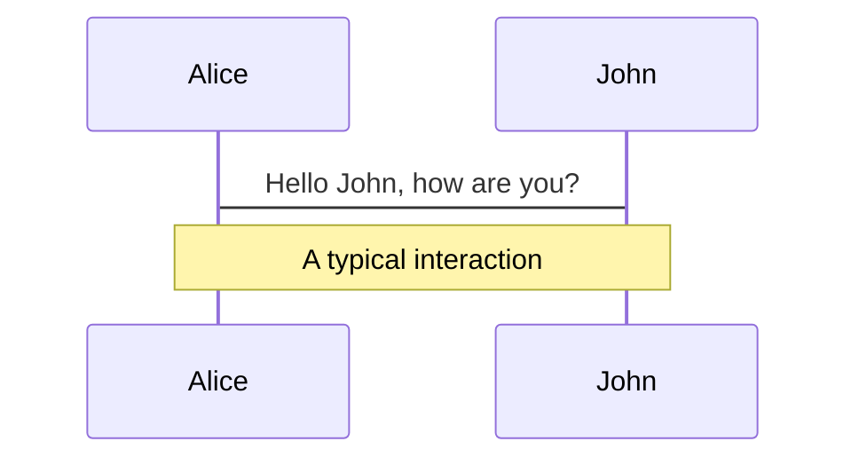
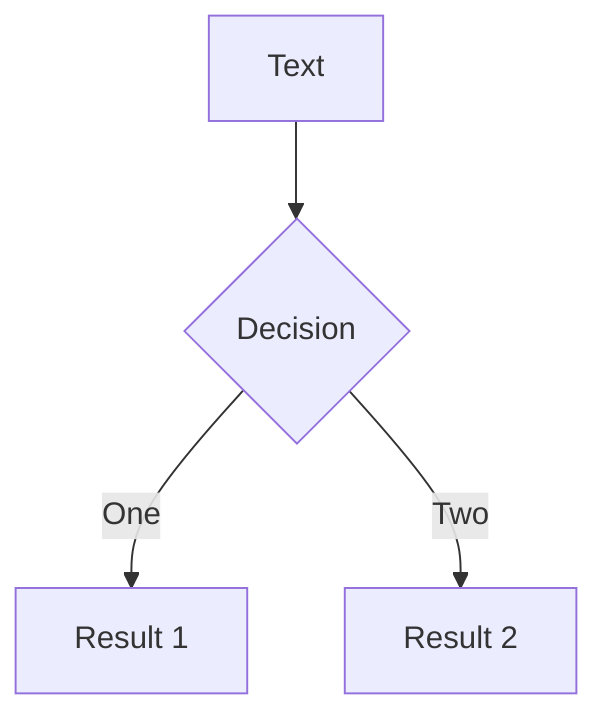
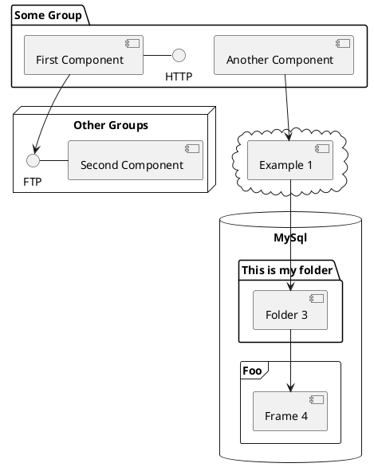

---
# try also 'default' to start simple
theme: apple-basic
# random image from a curated Unsplash collection by Anthony
# like them? see https://unsplash.com/collections/94734566/slidev
background: https://source.unsplash.com/collection/94734566/1920x1080
# apply any windi css classes to the current slide
class: 'text-center'
# https://sli.dev/custom/highlighters.html
highlighter: shiki
# show line numbers in code blocks
lineNumbers: false
# some information about the slides, markdown enabled
info: |
  ## Slidev Starter Template
  Presentation slides for developers.

  Learn more at [Sli.dev](https://sli.dev)
# persist drawings in exports and build
drawings:
  persist: false
---

# Pest - Tests in PHP die Spaß machen
## Slides auf pest-talk.netlify.app

---
layout: section
---

# Kommt euch das bekannt vor?

---
layout: quote
---

# „Am Ende schreiben wir noch ein paar Tests...“

---
layout: quote
---

# „Für Tests haben *wir* keine Zeit“

---
layout: quote
---

# „Tests zu schreiben verdoppelt den Code den ich schreiben muss“

---
layout: quote
---

# „Für's Testen haben wir unseren Staging-Server“

---
layout: quote
---

# „Für's Testen haben wir unsere Endnutzer“

---
layout: section
---

# Warum testen wir Code?

---
layout: statement
---

# Um zu schauen, ob der Code das tut, was er soll

## 🙄

---

# Das kann man auf verschiedene Arten tun:

<v-clicks class="text-3xl">

- manuell
- Typisierung
- Statischer Analyse
- Benchmarking
- Automatisierten Tests

</v-clicks>

<arrow v-click="5" x1="600" y1="500" x2="430" y2="370" color="#564" width="5" arrowSize="5" />

---
layout: section
---

# Warum testen wir **automatisiert** Code?

---

# Warum testen wir **automatisiert** Code?

<v-clicks class="text-3xl">

- Tests ermöglichen uns, Code mit mehr Sicherheit zu refactorn
- Tests sind Dokumentation für Entwickler
- Tests ermöglichen uns bessere Continuous Integration
- Tests lassen uns eher an Edge Cases denken

</v-clicks>

---
layout: statement
---

# Tests sorgen dafür, dass man nicht nur am Anfang schnell ist

---

# Das Testingjargon kann etwas einschüchternd sein

<v-clicks>

- Units
- Features
- Integration
- End-to-End-Tests
- Mocks
- Spies
- Factories
- Snapshots
- Assertions
- Test Coverage

</v-clicks>

---
layout: statement
---

# Wichtig für uns:

<div class="mt-16 space-y-8">

## Unit-Tests
## Feature-Tests

</div>

---
layout: center
---

# Und damit herzlich Willkommen...

---
layout: cover
---

# Pest - Tests in PHP die Spaß machen
## mein zweiter clickbar. Fullstack Talk
### von Alexander von Studnitz

---
layout: center
---

# Ich bin Alex

- 🧑‍💻 Arbeite bei clickbar.
- 👨‍🎓 Habe Informatik studiert
- 🕺 Tanze Swing in meiner Freizeit
- 🐥 bin auf Twitter (@jvstudnitz)

---
layout: center
---

# Was ist Pest?

---
layout: center
---

# Pest ist ein Testing-Framework

---
layout: center
---

# Baut auf PHPUnit auf
## Alle vorhandenen PHPUnit-Tests laufen out of the box

---
layout: center
---

# Ist von Jest inspiriert
## PHP + Jest = Pest?

---
layout: center
---

# Legt extrem Fokus auf eine simple API
## Extrem wenig Boilerplate

---
layout: two-cols
class: p-2
---

# PHPUnit

```php {all|6,8|all}
use PHPUnit\Framework\TestCase;

class SomethingTest extends TestCase
{
    /** @test */
    public function true_is_true()
    {
        $this->assertTrue(true);
    }
}

```

::right::

# Pest

```php
test('true is true', function () {
    $this->assertTrue(true);
});
```

<div class="mt-8" v-click="3">

```php
test('true is true')->assertTrue(true);
```

</div>


---
layout: section
---

# Ran an's Live Coding!

---
layout: center
---

# Pest installieren
### `composer require pestphp/pest --dev --with-all-dependencies`

---
layout: center
---

# Beispielprojekt mit Laravel
```sh
composer require pestphp/pest-plugin-laravel --dev
php artisan pest:install
```

---
layout: center
---

# In anderen Projekten
## `./vendor/bin/pest --init`


---
layout: center
---

# Pest ausführen
## `./vendor/bin/pest`

---
layout: center
---

# Beispiel: `Person`-Klasse
## Hat `firstName` und `lastName` und eine `greet()`-Methode

---
layout: center
---

# Für die Person Max Mustermann soll `greet()` "Hello, Max Mustermann!" ausgeben

---
layout: center
---

# Für die Person Maria Musterfrau soll `greet()` "Hello, Maria Musterfrau!" ausgeben

---
layout: center
---

# Eine `Person` kann ein `birthDay` haben und `age()` gibt das aktuelle Alter zurück

---
layout: center
---

# 💡 Tests, die wir noch nicht implementiert haben schreiben wir so

``` php
it('can get the right age');

it('greets a person with Happy Birthday on their birthday');
```

---
layout: center
---

# `->only()` und `->skip()`

---
layout: center
---

# `daysUntilBirthday()` implementieren und testen

---
layout: center
---

# `setLastName()` implementieren und testen
## Expectations/Assertions müssen nicht am Ende des Tests stehen

---
layout: center
---

# Mit `with()` Datasets definieren und Code sparen

---
layout: center
---

# `with()` kann man sogar kombinieren!
## Dabei entsteht dann das kartesische Produkt

---
layout: center
---

# Higher-Order-Expectations

---
layout: center
---

# Higher-Order-Tests

---
layout: center
---

# Laravel-spezifische Sachen
## Wir bauen nun ein Webfrontend für das Verwalten von den Personen

---
layout: center
---

# Eloquent-Model anlegen

---
layout: center
---

# View für /persons

---
layout: center
---

# View für /persons/{person}


# Welcome to Slidev

Presentation slides for developers

<div class="pt-12">
  <span @click="$slidev.nav.next" class="px-2 py-1 rounded cursor-pointer" hover="bg-white bg-opacity-10">
    Press Space for next page <carbon:arrow-right class="inline"/>
  </span>
</div>

<div class="abs-br m-6 flex gap-2">
  <button @click="$slidev.nav.openInEditor()" title="Open in Editor" class="text-xl icon-btn opacity-50 !border-none !hover:text-white">
    <carbon:edit />
  </button>
  <a href="https://github.com/slidevjs/slidev" target="_blank" alt="GitHub"
    class="text-xl icon-btn opacity-50 !border-none !hover:text-white">
    <carbon-logo-github />
  </a>
</div>

<!--
The last comment block of each slide will be treated as slide notes. It will be visible and editable in Presenter Mode along with the slide. [Read more in the docs](https://sli.dev/guide/syntax.html#notes)
-->

---

# What is Slidev?

Slidev is a slides maker and presenter designed for developers, consist of the following features

- 📝 **Text-based** - focus on the content with Markdown, and then style them later
- 🎨 **Themable** - theme can be shared and used with npm packages
- 🧑‍💻 **Developer Friendly** - code highlighting, live coding with autocompletion
- 🤹 **Interactive** - embedding Vue components to enhance your expressions
- 🎥 **Recording** - built-in recording and camera view
- 📤 **Portable** - export into PDF, PNGs, or even a hostable SPA
- 🛠 **Hackable** - anything possible on a webpage

<br>
<br>

Read more about [Why Slidev?](https://sli.dev/guide/why)

<!--
You can have `style` tag in markdown to override the style for the current page.
Learn more: https://sli.dev/guide/syntax#embedded-styles
-->

<style>
h1 {
  background-color: #2B90B6;
  background-image: linear-gradient(45deg, #4EC5D4 10%, #146b8c 20%);
  background-size: 100%;
  -webkit-background-clip: text;
  -moz-background-clip: text;
  -webkit-text-fill-color: transparent;
  -moz-text-fill-color: transparent;
}
</style>

---

# Navigation

Hover on the bottom-left corner to see the navigation's controls panel, [learn more](https://sli.dev/guide/navigation.html)

### Keyboard Shortcuts

|     |     |
| --- | --- |
| <kbd>right</kbd> / <kbd>space</kbd>| next animation or slide |
| <kbd>left</kbd>  / <kbd>shift</kbd><kbd>space</kbd> | previous animation or slide |
| <kbd>up</kbd> | previous slide |
| <kbd>down</kbd> | next slide |

<!-- https://sli.dev/guide/animations.html#click-animations -->

<p v-after class="absolute bottom-23 left-45 opacity-30 transform -rotate-10">Here!</p>

---
layout: image-right
image: https://source.unsplash.com/collection/94734566/1920x1080˚≈
---

# Code

Use code snippets and get the highlighting directly![^1]
˚≈
```ts {all|2|1-6|9|all}
interface User {
  id: number
  firstName: string
  lastName: string
  role: string
}

function updateUser(id: number, update: User) {
  const user = getUser(id)
  const newUser = {...user, ...update}
  saveUser(id, newUser)
}
```

<arrow v-click="3" x1="400" y1="420" x2="230" y2="330" color="#564" width="3" arrowSize="1" />

[^1]: [Learn More](https://sli.dev/guide/syntax.html#line-highlighting)

<style>
.footnotes-sep {
  @apply mt-20 opacity-10;
}
.footnotes {
  @apply text-sm opacity-75;
}
.footnote-backref {
  display: none;
}
</style>

---

# Components

<div grid="~ cols-2 gap-4">
<div>

You can use Vue components directly inside your slides.

We have provided a few built-in components like `<Tweet/>` and `<Youtube/>` that you can use directly. And adding your custom components is also super easy.

```html
<Counter :count="10" />
```

<!-- ./components/Counter.vue -->
<Counter :count="10" m="t-4" />

Check out [the guides](https://sli.dev/builtin/components.html) for more.

</div>
<div>

```html
<Tweet id="1390115482657726468" />
```

<Tweet id="1390115482657726468" scale="0.65" />

</div>
</div>


---
class: px-20
---

# Themes

Slidev comes with powerful theming support. Themes can provide styles, layouts, components, or even configurations for tools. Switching between themes by just **one edit** in your frontmatter:

<div grid="~ cols-2 gap-2" m="-t-2">

```yaml
---
theme: default
---
```

```yaml
---
theme: seriph
---
```


</div>

Read more about [How to use a theme](https://sli.dev/themes/use.html) and
check out the [Awesome Themes Gallery](https://sli.dev/themes/gallery.html).

---
preload: false
---

# Animations

Animations are powered by [@vueuse/motion](https://motion.vueuse.org/).

```html
<div
  v-motion
  :initial="{ x: -80 }"
  :enter="{ x: 0 }">
  Slidev
</div>
```

<div class="w-60 relative mt-6">
  <div class="relative w-40 h-40">
    
    
    
  </div>

  <div
    class="text-5xl absolute top-14 left-40 text-[#2B90B6] -z-1"
    v-motion
    :initial="{ x: -80, opacity: 0}"
    :enter="{ x: 0, opacity: 1, transition: { delay: 2000, duration: 1000 } }">
    Slidev
  </div>
</div>

<!-- vue script setup scripts can be directly used in markdown, and will only affects current page -->
<script setup lang="ts">
const final = {
  x: 0,
  y: 0,
  rotate: 0,
  scale: 1,
  transition: {
    type: 'spring',
    damping: 10,
    stiffness: 20,
    mass: 2
  }
}
</script>

<div
  v-motion
  :initial="{ x:35, y: 40, opacity: 0}"
  :enter="{ y: 0, opacity: 1, transition: { delay: 3500 } }">

[Learn More](https://sli.dev/guide/animations.html#motion)

</div>

---

# LaTeX

LaTeX is supported out-of-box powered by [KaTeX](https://katex.org/).

<br>

Inline $\sqrt{3x-1}+(1+x)^2$

Block
$$
\begin{array}{c}

\nabla \times \vec{\mathbf{B}} -\, \frac1c\, \frac{\partial\vec{\mathbf{E}}}{\partial t} &
= \frac{4\pi}{c}\vec{\mathbf{j}}    \nabla \cdot \vec{\mathbf{E}} & = 4 \pi \rho \\

\nabla \times \vec{\mathbf{E}}\, +\, \frac1c\, \frac{\partial\vec{\mathbf{B}}}{\partial t} & = \vec{\mathbf{0}} \\

\nabla \cdot \vec{\mathbf{B}} & = 0

\end{array}
$$

<br>

[Learn more](https://sli.dev/guide/syntax#latex)

---

# Diagrams

You can create diagrams / graphs from textual descriptions, directly in your Markdown.

<div class="grid grid-cols-3 gap-10 pt-4 -mb-6">







</div>

[Learn More](https://sli.dev/guide/syntax.html#diagrams)


---
layout: center
class: text-center
---

# Learn More

[Documentations](https://sli.dev) · [GitHub](https://github.com/slidevjs/slidev) · [Showcases](https://sli.dev/showcases.html)
